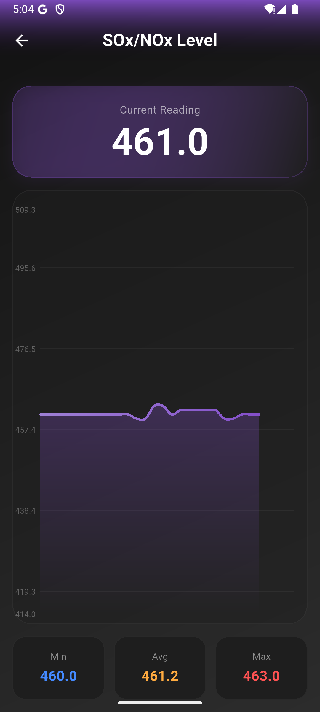

# Air360 🌬️

**Air360** is a comprehensive Air Quality Monitoring System that combines a hardware sensor node with a beautiful, premium Flutter mobile application. It provides real-time tracking of various air quality parameters including Dust, CO2, CO, Methane, Smoke, Temperature, Humidity, and Noise levels.

## 📸 Screenshots

| Dashboard | Sensor Graph |
|:---:|:---:|
|  |    |

## ✨ Features

- **Real-time Monitoring**: Live data updates every few seconds.
- **Multi-Sensor Support**:
  - **Dust Density** (GP2Y10)
  - **CO2 Levels** (MG811)
  - **Carbon Monoxide (CO)** (MQ-9)
  - **Methane (CH4)** (MQ-4)
  - **Smoke/Air Quality** (MQ-135)
  - **Noise Levels** (Sound Sensor)
  - **Temperature & Humidity** (DHT11)
- **Interactive Charts**: View historical data trends with touch-interactive graphs.
- **Premium UI**: Modern, dark-themed glassmorphism design.
- **Offline Capable**: Works over local Wi-Fi (Access Point Mode).
- **SD Card Logging**: Backs up data to an SD card on the device.

## 🛠️ Tech Stack

- **Mobile App**: Flutter (Dart), Fl_Chart, HTTP, Provider.
- **Hardware**: Arduino Nano RP2040 Connect, Arduino IDE (C++).
- **Connectivity**: HTTP / Wi-Fi (REST API).

## 📂 Project Structure

- **`/app`**: Complete source code for the Flutter mobile application.
- **`/firmware`**: Arduino/C++ code for the Arduino Nano RP2040 sensor node.

## 🚀 Getting Started

### 📱 Mobile App (Flutter)
1. **Prerequisites**: Ensure you have the Flutter SDK installed.
2. **Navigate to App Directory**:
   ```bash
   cd app
   ```
3. **Install Dependencies**:
   ```bash
   flutter pub get
   ```
4. **Run the App**:
   ```bash
   flutter run
   ```
5. **Build APK**:
   ```bash
   flutter build apk --release
   ```

### 🔌 Firmware (Hardware)
1. **Open Firmware**: Open `/firmware/air360_firmware_v2.ino` in the Arduino IDE.
2. **Install Libraries**:
   - `WiFiNINA` (for Nano RP2040 Connect)
   - `DHT sensor library`
3. **Configure**: Update `SSID` and `PASSWORD` in the code to set up the Access Point.
4. **Upload**: Connect your Arduino Nano RP2040 and upload the code.

## 🤝 Contributing
Contributions are welcome! Please fork the repository and submit a pull request.

## 📄 License
This project is licensed under the MIT License - see the LICENSE file for details.

---
*Developed by Harsh Kumar | Powered by Flutter & Arduino*
