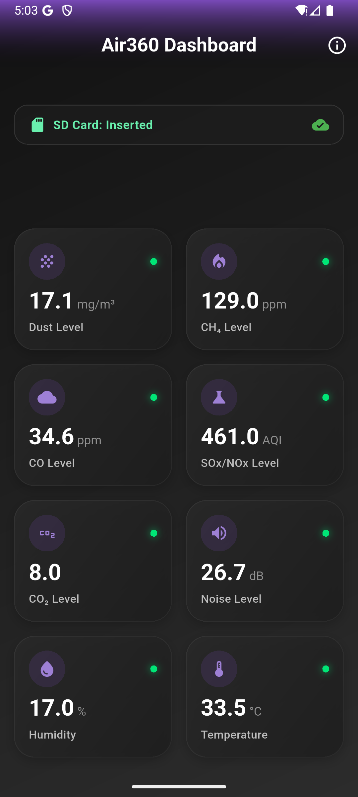
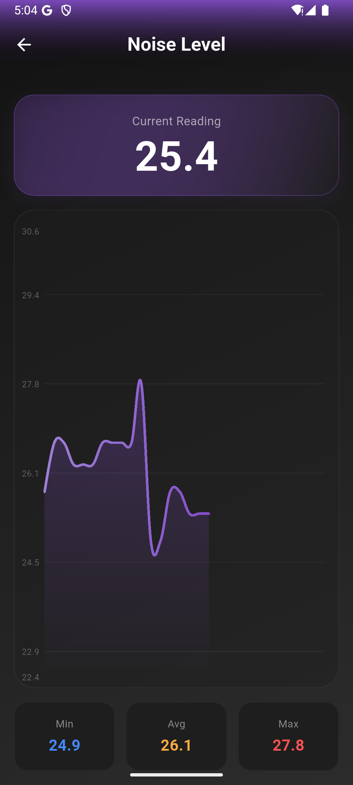

# Air360

A complete Air Quality Monitoring solution.

## Screenshots

| Dashboard | Sensor Graph |
|:---:|:---:|
|  |  |

## Project Structure

- **`/app`**: Flutter mobile application.
- **`/firmware`**: Arduino Nano RP2040 code.

## Getting Started

### Mobile App
1. Navigate to `/app`
2. Run `flutter pub get`
3. Run `flutter run`

### Firmware
1. Open `/firmware/air360_firmware_v2.ino` in Arduino IDE.
2. Install required libraries.
3. Upload to your Arduino Nano RP2040 board.
